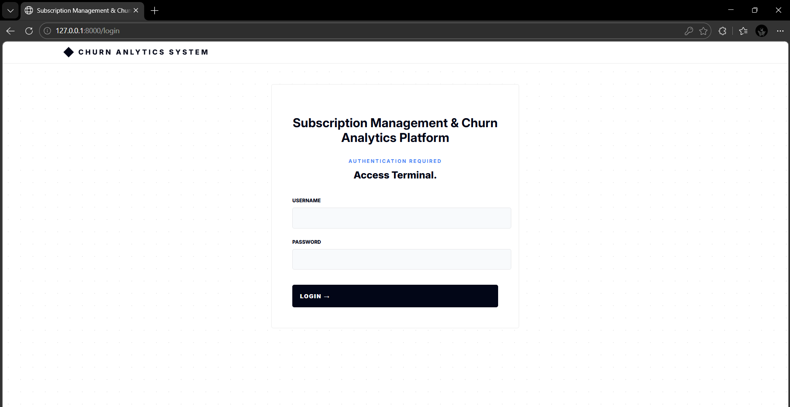
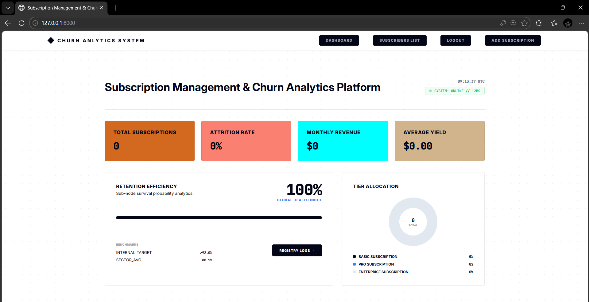
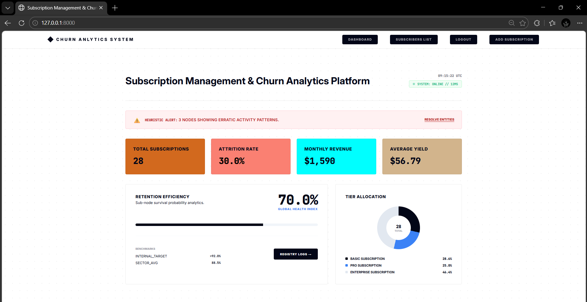
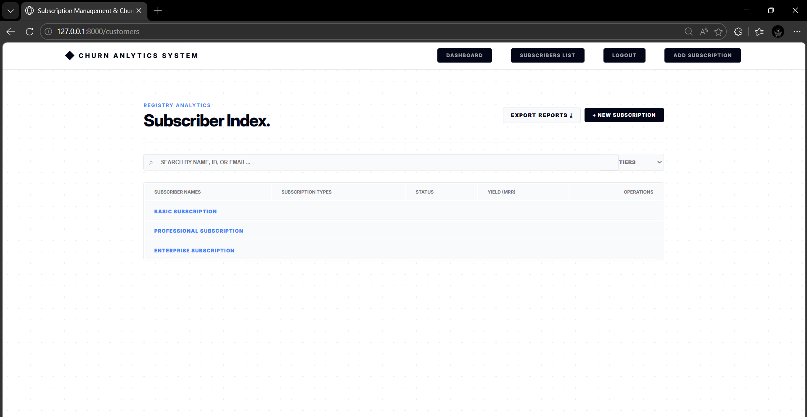
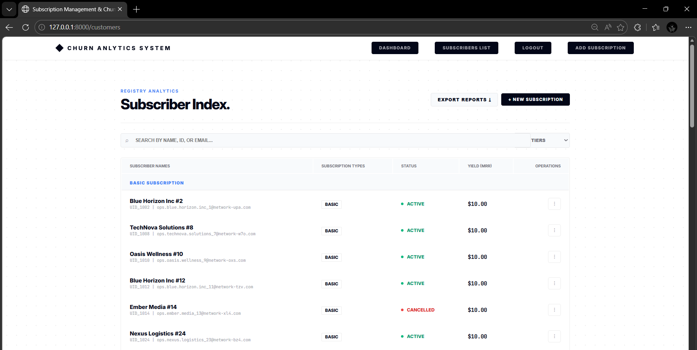
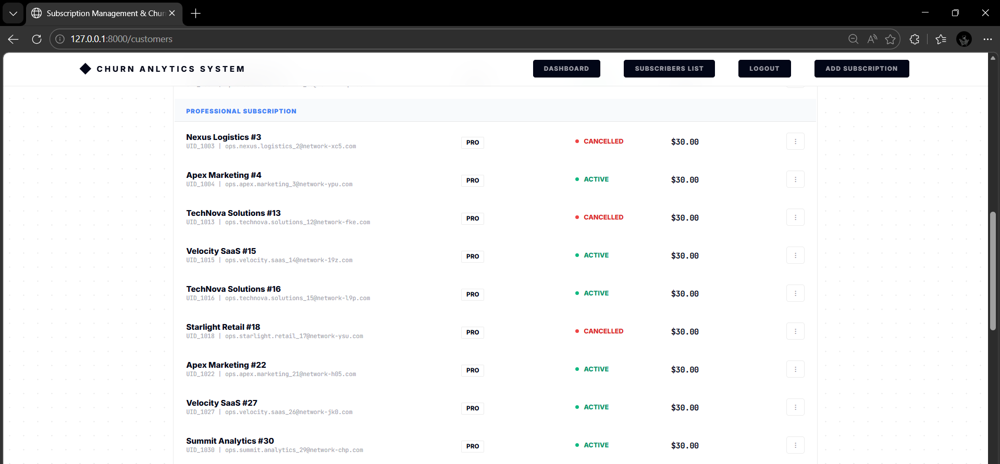
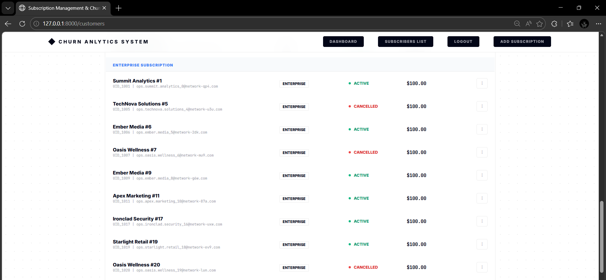
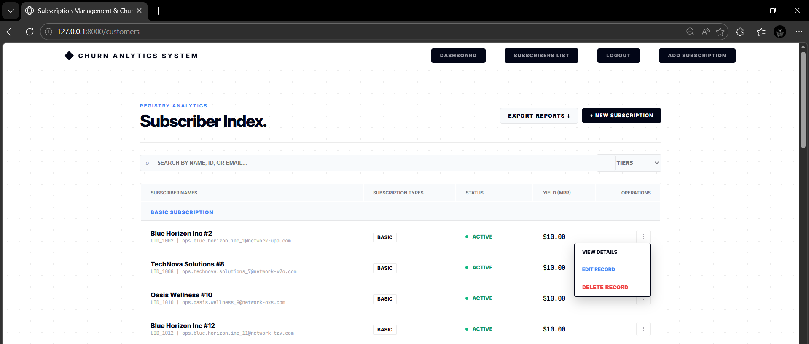

# Subscription Management & Churn Analytics System

A web-based Subscription Management and Churn Analytics System built using FastAPI.
This system allows businesses to manage customer subscriptions, track revenue metrics, and analyze churn patterns to improve customer retention.

## Project Description

The Subscription Management & Churn Analytics System is designed to help organizations manage subscription-based customers and analyze business performance using data analytics.

### It helps:

    - Manage customer subscriptions digitally

    - Track active and cancelled subscriptions

    - Monitor Monthly Recurring Revenue (MRR)

    - Analyze customer churn rate

    - Identify high-risk customers likely to churn

    - Generate analytics insights for business growth

    - Reduce manual tracking of subscription data

## Features

    - Customer Registration & Management

    - Subscription Plan Management

    - Active & Cancelled Subscription Tracking

    - Churn Rate Calculation

    - Monthly Recurring Revenue (MRR) Analytics

    - Average Revenue Per User (ARPU) Calculation

    - High Risk Customer Detection

    - Data Analytics using Pandas

    - RESTful API Architecture

    - Swagger API Documentation

    - Database Management using MySQL

    - Secure Data Validation & Error Handling

## Technologies Used

    - Backend: Python, FastAPI

    - Frontend: HTML, CSS, Jinja2 Templates

    - Database: MySQL

    - ORM: SQLAlchemy

    - Data Analytics: Pandas & NumPy

    - API Documentation: Swagger UI (FastAPI Docs)

    - Server: Uvicorn

    - Environment: Virtual Environment (venv)

## Installation & Setup

### step 1: Clone the Repository

    git clone https://github.com/KAVINPRABHAKAR/Subscription_Management_And_Churn_Analytics_System.git

### Step 2: Navigate to Project Directory

    cd  Subscription_Management_And_Churn_Analytics_System

### Step 3: Create Virtual Environment

    python -m venv venv

### Step 4: Activate Virtual Environment

    venv\Scripts\activate

### Step 5: Install Required Dependencies

    pip install -r requirements.txt

    If requirements.txt is not available, install manually:

    pip install fastapi uvicorn sqlalchemy pymysql pandas numpy jinja2

### Step 6: Configure MySQL Database

    - Create a MySQL database

    - Update database credentials in configuration file

    - Ensure database connection is properly set

### Step 7: Run the Application

    uvicorn main:app --reload

### Step 8: Open in Browser

    Swagger API Documentation

    http://127.0.0.1:8000/docs

### Step 9: Alternative API Docs

    ReDoc Documentation

    http://127.0.0.1:8000/redoc

### Now you can:

    - Add Customers

    - Manage Subscription Plans

    - Track Active Subscriptions

    - Monitor Cancelled Subscriptions

    - Analyze Churn Rate

    - Calculate Monthly Recurring Revenue (MRR)

    - Identify High Risk Customers

    - View Subscription Analytics

    - Test APIs using Swagger UI

## Output Screenshots

### Login Page

### Dashboard Page

### Subscribers List

### Basic level Subscribers

